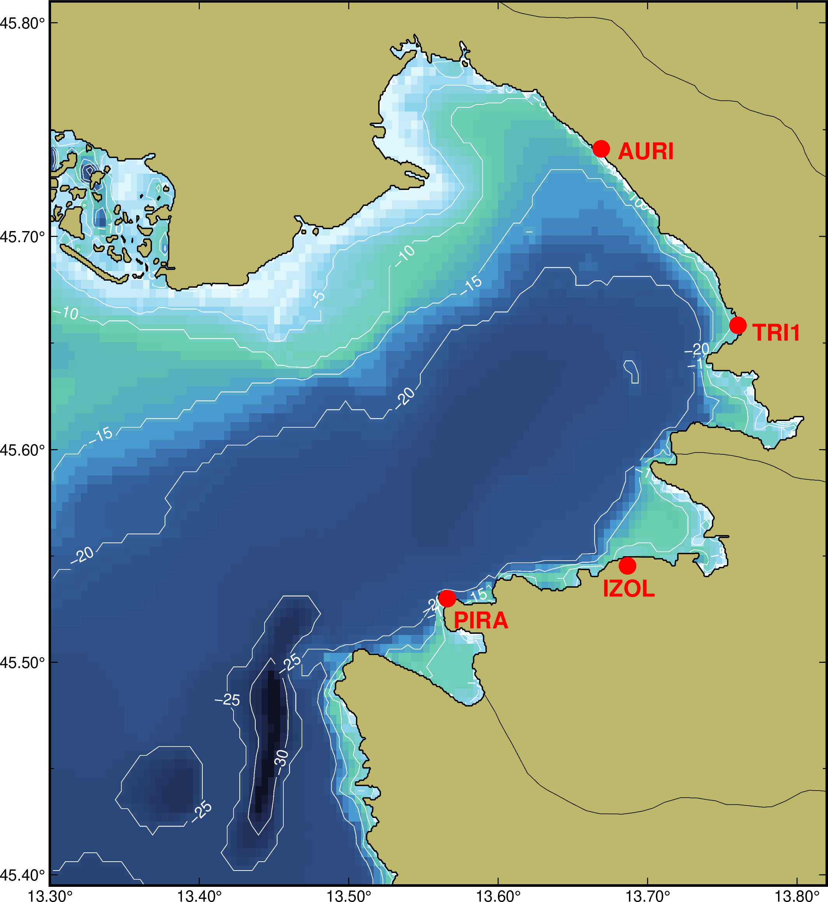

Station map of the HFR-NAdr high-frequency radar network (AURI, TRI1, IZOL,
PIRA). Hover over a station to see its details.

<map name='station_map'>
  <area shape='circle' coords='1212,1613,25' href='#' title='Station ID: PIRA&#10;Network ID: HFR-NAdr&#10;Institution Name: ARSO&#10;Longitude: 13.566&#10;Latitude: 45.53&#10;Frequency: 24.525 MHz&#10;Manufacturer: WERA' onclick='return false;'>
  <area shape='circle' coords='1997,875,25' href='#' title='Station ID: TRI1&#10;Network ID: HFR-NAdr&#10;Institution Name: ARPA&#10;Longitude: 13.7605&#10;Latitude: 45.6583&#10;Frequency: 24.525 MHz&#10;Manufacturer: WERA' onclick='return false;'>
  <area shape='circle' coords='1699,1524,25' href='#' title='Station ID: IZOL&#10;Network ID: HFR-NAdr&#10;Institution Name: NIB&#10;Longitude: 13.6866&#10;Latitude: 45.5454&#10;Frequency: 24.5 MHz&#10;Manufacturer: WERA' onclick='return false;'>
  <area shape='circle' coords='1628,398,25' href='#' title='Station ID: AURI&#10;Network ID: HFR-NAdr&#10;Institution Name: OGS&#10;Longitude: 13.669&#10;Latitude: 45.741&#10;Frequency: 24.635 MHz&#10;Manufacturer: WERA' onclick='return false;'>
</map>

See the [Data](data.qmd) page for downloadable current data.

WP1 system inventory report: forthcoming (pending final corrections).
